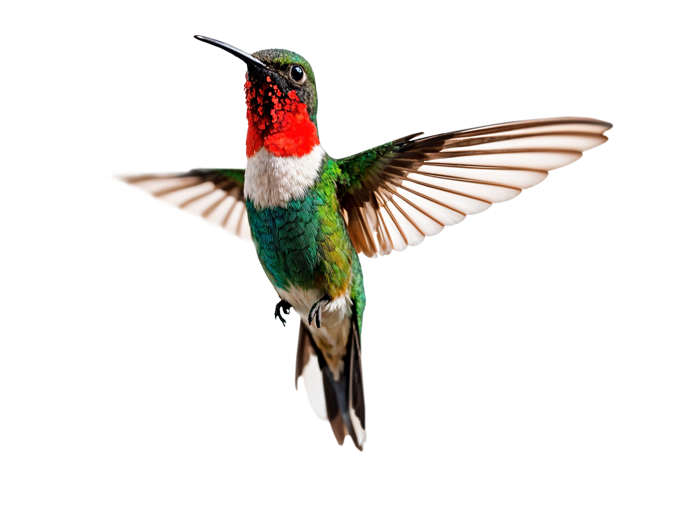

# Kolibri Web Designs 🐦✨

[](https://github.com/aayanshaikh/kolibriwebdesigns)
[](https://opensource.org/licenses/ISC)
[](https://parceljs.org/)
[](https://sass-lang.com/)

<p align="center">
  
</p>

Welcome to **Kolibri Web Designs**, where we *flit* through code like hummingbirds sipping nectar from the digital jungle! 🌿 This project crafts *vibrant*, *responsive* websites for small businesses, buzzing with emerald greens (#34856f) and coral pops (#e44c59). Built with love by **Aayan Shaikh**, Kolibri delivers bilingual magic in English and Russian, making your online presence soar. 🚀

> **Why Kolibri?** Because like a hummingbird, we’re small, agile, and pack a colorful punch! Don’t let bugs *bug* you—our sites are as smooth as a hummingbird’s hover.

## 📑 Table of Contents

- [🌟 Features](#-features)
- [🛠️ Getting Started](#%EF%B8%8F-getting-started)
- [🚀 Usage](#-usage)
- [📜 Scripts](#-scripts)
- [🧰 Tech Stack](#-tech-stack)
- [🤝 Contributing](#-contributing)
- [👨‍💻 About the Creator](#-about-the-creator)
- [📄 License](#-license)

## 🌟 Features

Kolibri Web Designs is packed with features to make your website *hum* with excitement:

- 🐦 **Bilingual Brilliance**: Flit between English (`/`) and Russian (`/ru/`) with ease.
- 📱 **Responsive Magic**: Looks stunning on desktops, tablets, and phones—like a hummingbird darting through any screen size.
- 🎨 **Vibrant Styling**: SCSS-powered designs with Bootstrap Icons and custom fonts, in lush greens and coral accents.
- ⚡ **Blazing Fast**: Parcel bundles assets faster than a hummingbird’s wings (up to 300 flaps per second, fun fact!).
- 🗺️ **SEO Ready**: Sitemaps for both languages, ensuring search engines love your site.

## 🛠️ Getting Started

Ready to make your website *flutter*? Follow these steps to set up Kolibri locally.

### Prerequisites
- **Node.js** (v14+): The engine powering our digital wings.
- **npm** (v6.6+): Our nectar for fetching dependencies.
- **Installation**: 
```bash
  # Clone the repo
  git clone https://github.com/aayanshaikh/kolibri-webdesigns.git
  # Navigate to the project
  cd kolibriwebdesigns
  # Install dependencies
  npm install
```

> 💡 **ProTip**: Ensure your terminal’s ready to *buzz*—run `node -v` and `npm -v` to check versions!

## 🚀 Usage

Launch Kolibri’s development server or build for production to see your site take flight.

### Development Mode
Spin up a local server with hot-reloading for both English and Russian sites:

```bash
npm run dev
```

- 🇬🇧 **English**: `http://localhost:1234`
- 🇷🇺 **Русский**: `http://localhost:8080/ru/`

Watch your changes *flit* live, no refresh needed!

### Production Build
```bash
npm run build
```

- 📂 **Output**: Optimized files in `/dist/`, ready to deploy.
- 🌐 **Public URL**: Assets served at `/`, perfect for hosting.
- 🗺️ **Sitemaps**: Copied to `dist/sitemap.xml` and `dist/ru/sitemap.xml` for SEO.

> 😂 **Fun Fact**: Our build is so fast, it could outrun a hummingbird mascot in a race to the cloud!

## 📜 Scripts

| Script           | Description                                                                 |
|------------------|-----------------------------------------------------------------------------|
| `npm run dev`    | Starts Parcel’s dev server for `src/index.html` and `src/ru/index.html`.    |
| `npm run build`  | Builds optimized assets, copies sitemaps to `dist/` and `dist/ru/`.         |

## 🧰 Tech Stack

Kolibri’s toolkit is as nimble as a hummingbird’s beak:

- **[Parcel](https://parceljs.org/)**: Zero-config bundler for speedy builds.
- **[Sass](https://sass-lang.com/)**: SCSS for modular, colorful styles.
- **[Bootstrap Icons](https://icons.getbootstrap.com/)**: Lightweight icons for UI flair.
- **[SVGO](https://github.com/svg/svgo)**: Optimizes SVGs for feather-light assets.
- **HTML/JavaScript**: The nectar holding it all together.

## 🤝 Contributing

Want to help Kolibri soar higher? Contributions are as welcome as a hummingbird to a flower garden! 🌸

1. 🍴 Fork the repo.
2. 🌿 Create a branch: `git checkout -b feature/hummingbird-tweak`.
3. 🐦 Commit changes: `git commit -m 'Added sparkly new feature'`.
4. 🚀 Push: `git push origin feature/hummingbird-tweak`.
5. 📬 Open a Pull Request.

Please keep code as clean as a hummingbird’s feathers and follow our style guide.

## 👨‍💻 About the Creator

Hi, I’m **Aayan Shaikh**, the brain behind Kolibri’s buzzing designs! I’m passionate about crafting websites that *flit* into users’ hearts. Reach out to me:

- 📧 **Email**: [aayan@aayanshaikh.com](mailto:aayan@aayanshaikh.com)
- 📞 **Phone**: [+91 9767596361](tel:+919767596361)
- 🌐 **GitHub**: [aayan-shaikh](https://github.com/aayan-shaikh/)

Got a project? Let’s make it *hum* together!

## 📄 License

Kolibri Web Designs is licensed under the [ISC License](https://opensource.org/licenses/ISC). Feel free to use, modify, and share—just don’t clip our wings! 🐦

---

**Kolibri Web Designs** © 2025 | Built with 💚 by Aayan Shaikh. Let’s *flit* to new digital heights!
```
